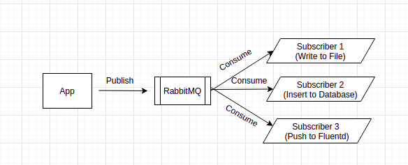
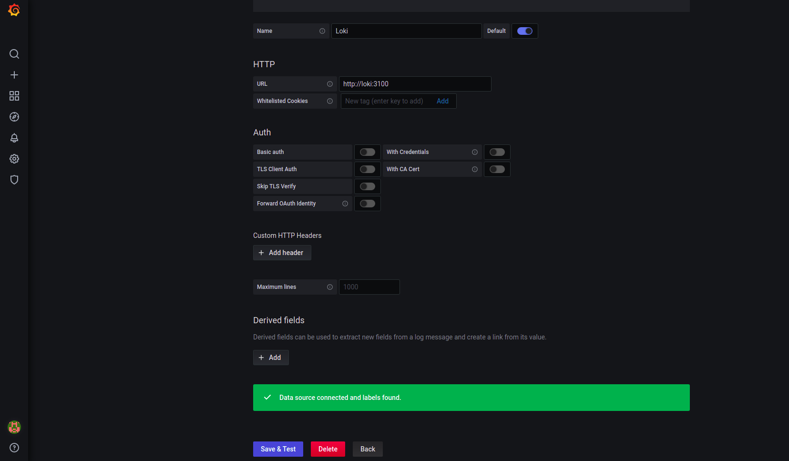
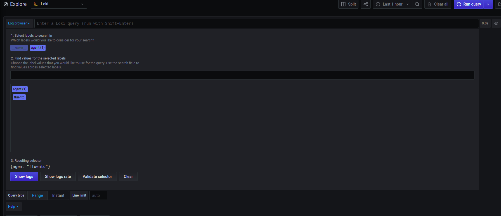
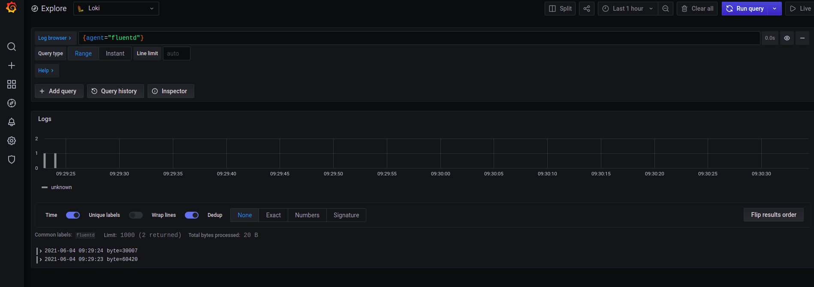

# Go Message Queue

## Topology
 

## Prerequisite

 1. Port 27017, 5672, 8080,8081, 3000, 3100, 24224,1323
 2. docker-compose 
 
 ## Getting Started
1. `sudo docker-compose up`
2. Hit `http://localhost:1323`

**subscriber 1** 
Check `subscribe-database` collection in `go-message-queue` MongoDB database with http://localhost:8081

**subscriber 2** 
Check log file  if it gets append with
`sudo docker exec -it go-message-queue_subscribe-file_1 sh -c 'cat /go/src/app/activity.log'`

**subscriber 3** 
1.  Login to grafana `http://localhost:3000` 
2. Add new Loki datasource `http://localhost:3000/datasources/new`
 
 3. Go to Explore page http://localhost:3000/explore 
 4.  Set datasource Loki where we have created before
  
  choose labels like the image above
 5.  Grafana will display our log as image below
   